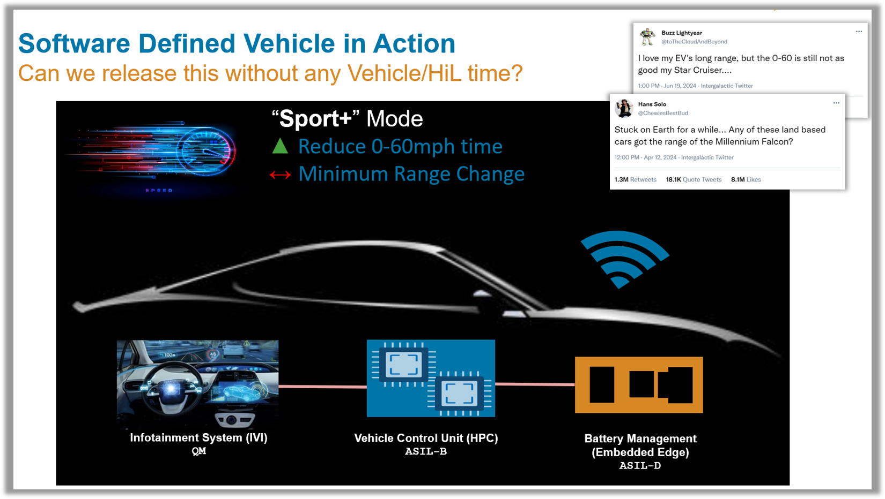

# Continuous Integration (CI) for MBD - Automate Model Testing and and Generate AUTOSAR Compliant Code

*Using automotive controllers as an example, let's learn how to setup CI pipelines and how it will benefit your team*

When multiple engineers are involved in making algorthms, we need to ensure the changes being made are coordinated and thoroughly tested. Automating this work saves you a lot of time while preserving the quality of your code. 

In this example, we assume we are a team working to release a new "Sport+" mode for their cars. Different engineers are making changes to the Vehicle Control Unit (VCU) and the Battery Management System (BMS) models. Whem the new updates are commited, this demo shows how to autoamte the testing, reporting and code generation tasks (Using GitLab CICD), so that we can successfully integrate and release the tested controller code.

-------------   

-------------   

## Demo Overview
With this demo, we highlight how to complete code generation, testing, checks and others tasks in an automated fashion using UI. But more than that, we showcase how multiple teams/team members working on different branches can potentially work together, and leverage CI to collaborate and build software.

### What's the customer's workflow look like once the CI pipelins are in place?
1. Clone the project locally
2. Switch to using up a development branch (bBattMgmt or bVCU)
3. Merge the main branch to their development branch. This way you have access to the latest work from all your colleagues.
4. Make changes to models and/or tests. Commit these changes and push them.
5. Confirm you can see the changes made are reflected in GitLab
6. Confirm you can see the changes made trigger and run a CI pipeline of 3 activities for the development branch.
7. Submit a merge request to merge the development changes to the main branch
8. Once the merge request is approved, confirm a CI pipeline of 5 activities get's run on the main branch.

## Relevant Apps/Workflows
- Use Continuous Integration (CI) to automate checks, tests and codeGen
- Using Projects and Source Control to manage your files/folders
- MISRA C Checks using Simulink Check
- MiL Testing with Simulink Test
- AUTOSAR - Generate Classic AUTOSAR compliant C code for BMS
- AUTOSAR - Generate Adaptive AUTOSAR compliant CPP code for VCU
- (coming soon) - Running CI workflows within a docker container on the Cloud (Contact smuckati@mathworks.com for more details)

## Relevant Products
Simulink, Stateflow, System Composer, Simulink Test, Embedded Coder, AUTOSAR Blockset, Simulink Check

## Special Instructions
Please refer to the presentation : [Demo Instructions](Internal/Continuous Integration for MBD Controllers.pptx).

## Recording
Demo overview and how to run it: [Microsoft Stream](https://mathworks.sharepoint.com/:v:/r/sites/aeg/Shared%20Documents/Stream%20Migrated%20Videos/AE%20Content%20Recordings/SDV_CI_Part.mp4?csf=1&web=1&e=JCzIpX&nav=eyJyZWZlcnJhbEluZm8iOnsicmVmZXJyYWxBcHAiOiJTdHJlYW1XZWJBcHAiLCJyZWZlcnJhbFZpZXciOiJTaGFyZURpYWxvZy1MaW5rIiwicmVmZXJyYWxBcHBQbGF0Zm9ybSI6IldlYiIsInJlZmVycmFsTW9kZSI6InZpZXcifX0%3D)

## Contact
Sameer K Muckatira

## Relevant Industries
* MBD adopter who are looking to use Continuous Integration, and starting on DevOps
* Automotive customers doing AUTOSAR compliant code generation looking for MiL and SiL